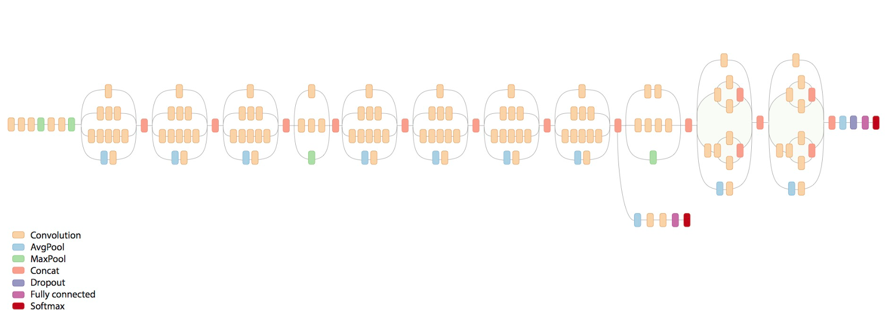

The block diagram of proposed algorithm for marker detection and robot navigation are provided in Figure 2 and Figure 3, respectively.

## 1) Marker Detection Phase: 
  Multiple images are captured using the Asus Xtion on-board camera while the robot rotates from a fixed position at constant speed. 
Simultaneously, the position and orientation of the robot is recorded when the images are captured and this data is stored in a Object Position Discovery (OPD) file. These images are passed through a
custom TensorFlow Inception v3 image classification engine. The top 5 classes of classified objects from the image are
listed by their match scores. From this list, the object with maximum score is written to OPD file along with the position
of the robot when the image was captured. After detection is complete, the OPD file is cleaned using a python script which
removes empty rows and columns and multiple labels of same class. The marker detection phase ends here.

  

## 2) Robot Navigation Phase: 
  In the navigation phase, all the recognized markers are prompted to the user for a selection of
a target to navigate to. Once user input for the desired object is acquired, the robot scans through the OPD file and identifies
the user-selected object and its corresponding position. If multiple entries of the same object are present within a certain
proximity of each other, an average of their positional data is calculated. Once the final position is calculated, the robot turns
and orients itself towards the desired object. After orienting towards the object, the distance to the object from the robot
is calculated using the on-board depth camera. The robot navigates towards the marker, constantly updating the distance
to travel and stops when it reaches user-defined threshold distance to the object.

  

## Inception v3 Image Recognition Engine

Inception v3 is a convolutional network developed by Google. Inception V3 builds an image classification system
for selected image classes by applying a prior trained deep learning model. This model can classify an image across 1000
categories supplied by the ImageNet academic competition and achieves 5.64% top-5 error. Inception architecture of
GoogLeNet was also designed to perform well even under strict constraints on memory and computational budget. The
computational cost of Inception is also much lower than VGGNet.

The Inception v3 engine is written using TensorFlow. TensorFlow is an open source software library for machine
learning developed by researchers and engineers working on the Google Brain Team. TensorFlow is defined as an
interface for expressing machine learning algorithms and an implementation for executing such algorithms [6].
The Inception v3 architecture is based on the process of determining how a optimal local sparse structure in a
convolutional vision network can be approximated and covered by readily available dense components. In order to avoid
patch-alignment issues, current incarnations of the Inception architecture are restricted to a range of filter sizes including
1x1, 3x3 and 5x5. Given that Inception v3 modules are stacked on top of each other, their output correlation statistics are
bound to vary. As features of higher abstraction are captured by higher layers, their spatial concentration is expected to
decrease suggesting that the ratio of 3x3 and 5x5 convolutions should increase moving up from the lower to higher layers.
An Inception network is a network consisting of modules of the above type stacked upon each other, with occasional maxpooling
layers with a stride of 2 to halve the resolution of the grid. The network is 22 layers deep when counting only layers
with parameters, or 27 layers if we also count pooling. The overall number of layers (independent building blocks) used
for the construction of the network is around 100. One of the main beneficial aspects of this architecture is that it allows
for increasing the number of units at each stage significantly without an uncontrolled increase in computational complexity.
The ubiquitous use of dimensionality reduction allows for shielding the large number of input filters of the last stage to
the next layer, first reducing their dimension before convolving over them with a large patch size. All the convolutions,
including those inside the Inception modules, use rectified linear activation functions. The size of the receptive field in
network is 224x224, taking RGB color channels with mean subtraction. The terms 3x3 reduce and 5x5 reduce stand for
the number of 1x1 filters in the reduction layer used before the 3x3 and 5x5 convolutions. All the reduction/projection layers
use rectified linear activation [7].

The schematic diagram of Inception v3 engine is provided in Figure 4.

Now since we have the algorithm developed for this project, next comes [Experimental Setup](https://github.com/AbhiRP/Autonomous-Robot-Navigation-using-Deep-Learning-Vision-Landmark-Framework/blob/master/Experimental%20Setup.md) used for the project.
